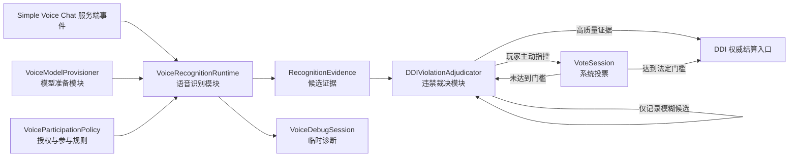

# DDI 综合改进计划

> 基线：`6d9d62a`（2026-07-19）  
> 状态：需求已确认，可进入分阶段实施  
> 范围：语音识别、裁决投票、模型与授权、词条管理、多词条、HUD、特殊事件音效、赛后排名、诊断与测试

## 1. 目标

把当前“识别结果直接触发扣血”的链路改造成两层职责明确的深模块：

1. **语音识别模块**只负责把 Simple Voice Chat 音频转换为带质量信息的候选证据；
2. **违禁裁决模块**负责判断自动扣血、等待人工指控、发起投票或忽略。

最终应满足：

- 宁可漏判，不允许低质量识别直接误扣血；
- 玩家可以主动指控，投票由系统自动组织、计时和裁决；
- 房主或服务端只需首次下载一次模型，其他玩家不下载模型；
- 模型下载、校验、解压和加载进度在游戏内可见；
- 玩家不再手输授权命令，改为一次点击确认；
- 轻声、连读、重复语气词和自定义词的识别问题可以通过临时调试转写复现和定位；
- 全部 DDI 词条可按分类及单条启用或禁用，自定义语音词具有完整管理能力；
- 每个 objective 支持 1～5 个独立词条槽，共享生命但分别计时和更换；
- HUD 默认美观地放置在右上安全区域，并显示所有公开目标的换词倒计时；
- 不同特殊事件可播放不同音效；
- 赛后排名同时呈现 Bingo 成绩和 DDI 剩余生命；
- DDI 规则不直接依赖 Simple Voice Chat、Vosk、模型路径或识别线程；
- 所有异步结果在结算前重新验证对局和词条版本。

## 2. 已确认的产品决策

以下内容视为本轮实现约束，不在开发过程中重新猜测：

### 2.1 自动识别

- 自动识别优先避免误判，允许一定漏判。
- 只有具有可靠逐词置信度并达到门槛的证据，才允许直接扣血。
- 仅有最终文本、没有逐词置信度的精确匹配不能直接扣血。
- partial result 永远不能触发扣血。
- 音频、PCM、完整转写和自定义关键词不落盘、不写普通日志。

### 2.2 人工指控与投票

- 指控由玩家主动发起，不由系统因每个模糊识别结果自动弹票。
- 系统负责验证指控资格、生成投票、统计、超时和最终裁决。
- 被指控玩家所在整支队伍不能投票。
- 其余当前语音对局参与者可以投票。
- 投票创建时冻结被指控队伍和合资格投票人，避免中途换队、进退语音组改变规则。
- 至少需要 2 名合资格投票人。
- 同意票达到合资格投票人的 `2/3` 才扣血。
- 不足 2 人、票数不足、平票或超时未达到门槛均不处罚。
- 两队模式继续使用相同规则，不增加特殊裁决分支。

首版默认时间参数：

| 参数 | 默认值 | 说明 |
| --- | ---: | --- |
| 可指控的近期窗口 | 8 秒 | 用于关联近期模糊识别；没有识别候选也允许人工指控 |
| 投票时长 | 5 秒 | 到期自动结算 |
| 发起指控冷却 | 10 秒 | 按发起玩家计算 |
| 同一被指控目标并发票数 | 1 | 防止重复投票 |

这些值必须进入配置，不应散落为实现常量。

### 2.3 模型分发

- 识别运行在 Simple Voice Chat 服务端；开放联机时，开房玩家的集成服务器就是识别端。
- 只有房主或独立服务器下载和加载模型。
- 不把约 43.9 MB 的中文模型放进主模组 JAR。
- 不让每个客户端下载模型。
- 不创建仅用于携带模型的代码模组。
- 默认采用“服务端外置缓存 + 游戏内下载 + 完整校验”。
- 额外提供可离线预置的 server-only model bundle，供整合包和无网环境使用。
- 当前通用模组仍会把 Vosk Java/native 运行库交付给客户端；这不是识别模型，
  但需要测量其成品体积占比。
- 若运行库体积明显影响所有玩家下载，则把 Vosk adapter 做成可选 server-only
  语音扩展；主模组只保留 `VoiceRecognitionRuntime` interface 和安全降级实现。

### 2.4 玩家授权

- 不采用无提示的默认同意。
- 用一次性点击确认替代手动输入 `/bingoprefs ddi_voice_consent true`。
- 玩家可以拒绝或撤回；撤回后必须立即停止处理其后续音频。
- 队伍共享语音词只在当前有效队员全部同意并连接语音时进入候选池。

### 2.5 识别质量与调试

- “轻声检测”不是 Simple Voice Chat 耳语模式，而是自然口语中的轻声音节、连读和重复音节。
- 已知复现场景包括：
  - “跳一下”中的“下”读轻声时容易漏识别，逐字清晰读“跳 一 下”才容易命中；
  - 自定义词通常需要逐字清晰发音；
  - “啊啊”等重复音节容易被合并，必须刻意分开才容易命中。
- 模型优化目标是提高自然说话时的识别率和整体体验，同时继续优先避免自动误扣。
- 增加管理员临时语音转文字调试，用于查看模型听到了什么、错成什么词、在哪个阶段被拒绝。
- 调试转写默认关闭、限时、指定单个玩家、不落盘、不广播。
- 在获得可重复音频样本前，不预设问题一定来自阈值、grammar、分句或模型。

### 2.6 词条目录与自定义语音词

- 全部 DDI 词条都进入可管理目录。
- 房主可以按分类整体启用/禁用，也可以覆盖单条词的选中状态。
- 现有 `legacy` 词条在界面中显示为“基础词条”。
- 使用菜单墙分类页和分页词条页；搜索使用文本对话框。
- 自定义语音词不设置产品可见的数量上限。
- 仍保留单词长度、规范化去重、总序列化字节数和单次操作大小等技术安全约束。
- 自定义词管理必须支持搜索、分页、启用/禁用、编辑识别形式、删除确认和批量导入导出。

### 2.7 每队多个词条

- 大厅可配置每个 objective 同时拥有 1～5 个词条。
- 默认 1 条，保持旧配置兼容。
- 每个词条槽拥有独立词条、进度、倒计时和 assignment revision。
- 触发或到期只更换对应槽。
- 所有槽共享 objective 的生命池。
- 同一 objective 的活动槽之间不分配相同 `repeatKey`。
- 同一个权威游戏信号先匹配全部活动槽，命中几条就扣几颗心并更换几条。
- 大厅提供“同一行为最多结算词条数”：`1～5 / 全部`，默认“全部”。
- 限时满足型词条可以同时更新，不占用违规扣血数量上限。

### 2.8 HUD 与公开倒计时

- 当前已经公开的其他玩家或其他队伍词条继续公开，并在每条后显示独立换词倒计时。
- 自己或自己队伍的词条文本继续隐藏，但显示每个隐藏槽的倒计时和生命。
- 默认位置采用有安全边距的右上角；具体位置、缩放、透明度继续允许客户端自行调整。
- 多玩家、多队伍或多词条导致高度不足时，HUD 必须折叠或摘要显示，不遮挡主要视野。

### 2.9 特殊事件音效

- 每种特殊事件都可以配置不同的 Minecraft 音效、音量和音高。
- 事件开始时向当前 DDI 参与者播放对应音效。
- 音效属于提示反馈，不改变事件规则或时序。
- 提供全局开关和音量控制，避免高频事件造成听觉干扰。

### 2.10 赛后排名

- 赛后队伍表同时显示当前 Bingo 计分模式的成绩、DDI 剩余生命和完成/淘汰时间。
- Bingo 原因结束时按 Bingo 成绩优先，DDI 生命作为同分比较项。
- DDI 原因结束时按 DDI 存活结果优先，Bingo 成绩作为同分比较项。
- 界面必须明确显示排序依据，避免胜者和表格排名看起来矛盾。

## 3. 当前审查问题

### P0：可能造成错误处罚

1. `VoiceKeywordText` 在 Vosk 结果缺少逐词数组时，会把最终文本精确匹配构造成
   `confidence = 0.0` 的匹配。
2. `SimpleVoiceKeywordBackend` 仍会把该匹配交付给 DDI。
3. `DDIObjectiveManager.onVoiceKeywordDetection` 对通过版本校验的检测直接产生
   `VOICE_KEYWORD_SPOKEN` 信号并扣血。

这与“宁可漏判，不可误扣”冲突，必须先修复。

### P1：人工裁决规则尚未实现

当前仓库没有 DDI 语音指控、投票会话、选民快照、法定人数或 `2/3` 结算实现。
现有 Ready 投票属于开局准备流程，不能复用其领域规则。

### P1：模型准备体验不完整

- 当前在进入语音 DDI 对局后自动请求模型下载，时机过晚。
- 下载循环已经统计 `copied` 字节，但状态只暴露 `DOWNLOADING`。
- 校验、解压、加载均没有独立进度阶段。
- 失败只提供粗粒度错误详情，没有面向房主的重试动作。
- 文档对“自动下载”和“管理员手动下载”存在表述不一致。

### P1：授权体验不完整

- `ddiVoiceConsent` 是布尔值，无法区分“尚未询问”和“明确拒绝”。
- DDI 菜单点击后只预填命令，仍需玩家手动发送。
- 提示文案中的“本机离线识别”容易被理解为每个客户端识别，应改成“房主/服务器本地离线识别”。

### P1：识别问题缺少可重复反馈回路

- 仓库当前没有“跳一下”“啊啊”或自定义词的真实音频夹具。
- 现有诊断只有 PCM 峰值、平均幅度和阶段计数，无法看到 Vosk partial、final、
  逐词置信度以及实际拒绝原因的完整关联。
- 在没有固定输入的情况下直接修改阈值或 grammar，无法判断是提高召回还是扩大误报。
- 自定义词是否属于模型词典外词、被怎样分词以及重复音节是否被合并，目前缺少游戏内证据。

### P1：词条选择和自定义词管理不足

- 词池已有 356 条，其中 161 条属于 `legacy`，但没有面向房主的完整分类选择界面。
- 特殊事件已有分页多选，普通 DDI 词条尚无同等管理能力。
- 自定义语音词当前硬限制为 32，只支持添加、移除、列出和重置，缺少搜索、
  启用状态、识别形式编辑、分页和批量操作。

### P1：单词条状态无法扩展

- `DDIObjectiveState` 只有一个 `currentWord`、一个计时器、一个进度和一个 revision。
- 个人与队伍同步包都只传输一个词条。
- HUD、语音目标、触发结算、历史和调试命令均假定 objective 同时只有一个词条。
- 多词条必须先引入 assignment 槽模型，不能用多个旁路列表叠加。

### P2：HUD 与赛后投影不完整

- 服务端已向客户端同步其他目标的倒计时，但 HUD 行只显示其他目标的词和生命。
- 当前默认 HUD 已是 `TOP_RIGHT`，偏移为右侧 8px、顶部 80px；需要改成稳定的安全区布局。
- 赛后已有 Bingo 排名和 DDI 伤害历史，但没有 DDI 剩余生命/淘汰顺序排名。
- 特殊事件控制器没有统一的“事件已开始”音效映射。

### P2：语音运行库仍进入通用客户端成品

- 外部 Vosk 模型只由房主/服务器下载，但 `integration-voicechat` 的 Vosk Java/native
  依赖当前仍通过通用模组构建分发。
- “其他玩家不下载模型”不等于“其他玩家不下载任何 Vosk 运行库”。
- 是否拆成 server-only 语音扩展应由实际成品体积和安装复杂度共同决定。

### P2：模块职责过宽

- `VoiceKeywordBridge` 同时处理后端生命周期、模型状态、会话、连接玩家、
  目标发布、诊断、冷却和检测交付，存在 Divergent Change。
- `VoiceKeywordText` 同时处理规范化、别名展开、Vosk grammar 生成、重复词容错、
  JSON 结果解析和置信度判断。
- `DDIObjectiveManager` 直接查询 `VoiceKeywordBridge` 的状态和玩家连接情况，
  并直接结算识别结果。
- `"voice:<word>"` 的编码规则散落在词表和实现中，缺少统一值类型。

### P2：验证环境未固定

当前本机 `JAVA_HOME` 指向 Java 8，Gradle 9.2.1 无法启动测试。目标 Minecraft
版本应使用 Java 21。合并前必须在固定 Java 21 环境重新执行完整测试和正式构建。

## 4. 目标模块与数据流



### 4.1 `VoiceRecognitionRuntime`

这是 `integration-voicechat` 对 DDI 提供的唯一外部 seam。它隐藏：

- Simple Voice Chat 事件注册与连接状态；
- 每玩家有界队列和串行 actor；
- Opus 解码、重采样和分句；
- Vosk 模型与 recognizer 生命周期；
- grammar 生成和结果匹配；
- 安全诊断计数。

建议保持小接口：

```kotlin
interface VoiceRecognitionRuntime {
    fun open(session: RecognitionSession): AutoCloseable
    fun snapshot(): VoiceRuntimeSnapshot
    fun prepareModel(): CompletionStage<ModelPreparationSnapshot>
}
```

`RecognitionSession` 持有不可变或原子替换的目标快照及证据接收函数。调用方不再分别
查询模型、连接玩家、目标和后端，也不直接接触 Simple Voice Chat 类型。

Simple Voice Chat 是生产 adapter；测试使用内存 adapter。该 seam 因存在两种
adapter 而具有实际价值。

### 4.2 `RecognitionEvidence`

识别模块不输出“应该扣血”，只输出事实：

```kotlin
data class RecognitionEvidence(
    val playerId: UUID,
    val objectiveId: UUID,
    val gameId: UUID,
    val assignmentRevision: Long,
    val subjectId: VoiceSubjectId,
    val quality: EvidenceQuality,
    val confidence: ConfidenceSummary?,
    val observedAt: Instant,
)

enum class EvidenceQuality {
    VERIFIED,
    AMBIGUOUS,
}
```

约束：

- `VERIFIED` 必须存在逐词置信度并通过全部门槛；
- 无置信度文本回退最多只能成为 `AMBIGUOUS`；
- 不匹配、partial、低置信和无效 grammar 不产生证据；
- 证据不包含完整转写文本。

### 4.3 `DDIViolationAdjudicator`

这是 DDI 侧唯一决定处罚的深模块，负责：

- 重验对局、objective、词条和 assignment revision；
- 自动证据的直接处罚策略；
- 近期模糊候选的短期内存记录；
- 指控权限、冷却和防重复；
- 投票人快照、团队排除、法定人数和超时；
- 生成可审计但不含音频或转写的裁决结果；
- 调用统一 DDI 结算入口。

建议接口：

```kotlin
interface DDIViolationAdjudicator {
    fun submitEvidence(evidence: RecognitionEvidence): AdjudicationResult
    fun accuse(command: AccusationCommand): AdjudicationResult
    fun castVote(command: VoteCommand): AdjudicationResult
    fun tick(now: Instant): List<AdjudicationResult>
}
```

该接口同时作为测试面。投票规则测试不需要启动 Minecraft、Simple Voice Chat 或 Vosk。

### 4.4 `VoiceModelProvisioner`

该模块应深化现有 `VoiceKeywordModelManager`，把下载、校验、解压、原子安装、加载、
重试和离线预置检测放在同一实现中。

对外状态：

```text
MISSING
AWAITING_HOST_CONFIRMATION
DOWNLOADING(bytesDownloaded, totalBytes)
VERIFYING
EXTRACTING
LOADING
READY
FAILED(errorCode, retryable)
UNSUPPORTED
```

要求：

- 操作幂等，同一时间最多一个准备任务；
- 每秒最多向游戏界面发布一次进度；
- 下载文件继续使用临时路径和固定长度、SHA-256 校验；
- 安装继续采用 staging + atomic move；
- 已有合法模型不访问网络；
- 失败不影响非语音 DDI 和普通 Bingo；
- 预置模型也必须经过目录结构与版本校验。

### 4.5 `VoiceParticipationPolicy`

把布尔授权升级为：

```text
UNASKED
GRANTED(policyRevision)
DECLINED(policyRevision)
```

该模块统一回答：

- 是否需要向玩家展示授权对话框；
- 玩家是否可以收到语音词；
- 队伍是否满足全员授权；
- 撤回后哪些目标需要无惩罚重抽；
- 隐私说明版本变化后是否需要重新确认。

### 4.6 `VoiceDebugSession`

该模块提供语音识别的临时、可撤销观察窗口，而不是永久日志功能。

一次调试会话绑定：

- 发起管理员；
- 单个目标玩家；
- 当前游戏和语音 session；
- 最长持续时间；
- 独立的目标玩家调试确认；
- 仅发给发起管理员的输出 sink。

输出应按一次分句聚合，避免逐包刷屏：

```text
玩家 / 分句时长 / PCM peak 与 RMS
partial / final
Vosk 逐词结果与置信度
当前目标词及 grammar revision
规范化后的匹配路径
最终分类：命中 / 文本不符 / 低置信 / 空结果 / 无效 JSON
```

要求：

- 默认关闭，只有管理员可发起；
- 目标玩家额外点击同意后才开始；
- 最长建议 120 秒，到期、断线、撤回、换局时立即关闭；
- 原始音频、PCM、partial、final 和逐词文本均不落盘、不进入普通日志；
- 不改变正式识别门槛，不触发扣血；
- 同一时刻只允许少量调试会话，避免把语音线程变成日志线程。

### 4.7 `DDIWordCatalog`

深化现有 `DDIWordPool`，让目录、选择策略、自定义词和随机抽取共享同一事实来源。

核心状态：

```text
WordDefinition
CategoryDefinition
WordSelectionPolicy(categoryDefaults, wordOverrides)
CustomVoiceWord(displayText, spokenForms, enabled)
```

有效选择采用“分类默认值 + 单词覆盖”，而不是保存一份所有词 ID 的巨大快照。
这样新增内置词时可以继承分类默认值，同时仍允许房主单独关闭某一词。

菜单流程：

```text
DDI 设置墙
  -> 词条池（已选数量 / 总数）
     -> 分类页（分类开关、数量）
        -> 词条分页（逐条开关）
     -> 搜索对话框
     -> 全选 / 全不选 / 恢复默认
     -> 自定义语音词管理
```

自定义词不设数量上限，但目录实现必须：

- 增量更新，避免每次操作重发整个 `BingoOptions`；
- 搜索和分页，不一次渲染全部词；
- 使用稳定 ID，不因编辑显示文本而破坏历史；
- 规范化后去重；
- 限制单词长度、单次导入体积和总序列化字节数；
- 支持多个 `spokenForms`，为自然连读、常见读法和模型可识别形式提供显式配置；
- 删除正在使用的词时，只无惩罚重抽关联槽。

### 4.8 `DDIAssignmentSet`

将 objective 的单个 `currentWord` 改为有序槽集合：

```kotlin
data class DDIWordAssignment(
    val slotId: Int,
    var word: WordDefinition,
    var timerSeconds: Int,
    var maxTimerSeconds: Int,
    var ruleProgress: Int,
    var deadlineSatisfied: Boolean,
    var assignmentRevision: Long,
)
```

`DDIObjectiveState` 继续拥有生命、成员和淘汰状态；每个槽独立拥有词条相关状态。
所有异步和同步操作必须携带 `objectiveId + slotId + assignmentRevision`。

该模块负责：

- 一次填满配置数量的槽；
- 同一 objective 活动槽不重复；
- 单槽触发、到期、失效和无惩罚重抽；
- 词池不足时明确降级；
- 多槽信号匹配和每 tick 结算顺序；
- 生成 HUD、语音目标和调试命令所需快照。

同一个权威游戏信号在同一 tick 同时命中多个不同槽时，
由 `maxSettlementsPerSignal` 决定本次最多结算多少个违规槽。默认值为“全部”，即命中几条
就扣几颗并更换几条；房主也可以设置为 1～5。匹配和扣血按一个原子批次完成，最后只检查
一次胜负，避免槽迭代顺序产生中间胜者。

### 4.9 `DDIStandingProjection`

赛后排名不应在聊天、Dialog 和客户端屏幕各自实现排序。建立一个纯计算模块，根据结束原因
生成统一队伍 standings：

```text
rank / team / bingoScore / ddiHearts / ddiEliminatedAt / completionTime / sortReason
```

聊天结算、原生结束屏和 Dialog 都消费同一个快照。特殊事件音效则作为
`DDISpecialEventDefinition` 的展示元数据，由事件开始路径统一播放，避免散落在 30 个事件实现中。

## 5. 分阶段实施

## 阶段 0：安全热修与基线固定

目标：在任何架构调整前消除已知误扣路径。

任务：

1. 将无逐词置信度的文本回退从自动检测交付中移除，或明确标记为 `AMBIGUOUS`。
2. `DDIObjectiveManager` 暂时拒绝 `confidence <= 0` 或证据来源不完整的检测。
3. 增加回归测试：
   - 最终文本精确匹配但无 word array：不得扣血；
   - partial 匹配：不得扣血；
   - 低平均或最低置信度：不得扣血；
   - 有效逐词置信度：仍能扣血；
   - 旧 assignment revision：不得扣血。
4. 将本地和 CI 构建统一到 Java 21。

验收：

- 不存在 `usedTextFallback = true` 仍进入自动扣血的路径；
- 三个模块测试和正式构建通过；
- `git diff --check` 通过。

## 阶段 1：引入统一裁决 seam

目标：先让“证据”和“处罚”解耦，再添加投票。

任务：

1. 建立 `RecognitionEvidence`、`EvidenceQuality` 和 `VoiceSubjectId`。
2. 实现 `DDIViolationAdjudicator`，首批只处理自动证据。
3. 将 `DDIVoiceKeywordController` 的检测回调改为提交证据。
4. 只有裁决模块可以调用 DDI 的语音扣血入口。
5. 将 `"voice:"` 编解码集中到 `VoiceSubjectId`。

验收：

- 识别模块不直接构造 `DDISignal`；
- `DDIObjectiveManager` 不再接收裸 `VoiceKeywordDetection`；
- 自动识别行为由裁决模块接口测试完整覆盖。

## 阶段 2：玩家指控与系统投票

目标：实现已确认的人工纠错机制。

任务：

1. 建立 `AccusationCommand`、`VoteCommand`、`VoteSession`。
2. 支持玩家主动选择被指控玩家；系统自动绑定其当前 objective 和语音词条版本。
3. 创建投票时冻结：
   - 被指控 objective；
   - 被排除的整队成员；
   - 合资格投票人集合；
   - 法定人数和通过票数。
4. 实现至少 2 人、`ceil(2 * eligible / 3.0)` 同意票门槛。
5. 建议首版把发起者默认计为一票“同意”，但其本身必须属于合资格投票人。
6. 实现超时、冷却、重复指控拒绝、玩家断线和对局结束清理。
7. 提供点击式投票消息；命令只作为兼容和调试入口。
8. 系统自动公布“通过 / 未通过 / 人数不足”，不公布识别文本或置信度。

验收矩阵至少覆盖：

| 场景 | 预期 |
| --- | --- |
| 1 名合资格投票人 | 不处罚 |
| 2 人中 2 票同意 | 处罚 |
| 2 人中 1 票同意 | 不处罚 |
| 3 人中 2 票同意 | 处罚 |
| 4 人中 3 票同意 | 处罚 |
| 被指控队友投票 | 拒绝 |
| 投票中途换队或加入 | 不改变选民快照 |
| 旧词条版本投票结算 | 不处罚 |
| 对局结束时仍在投票 | 取消且不处罚 |

## 阶段 3：语音模块深度与内部整理

目标：先完成架构收口，再在稳定接口上增加模型与授权体验。

任务：

1. 用 `VoiceRecognitionRuntime` 替代宽泛的 `VoiceKeywordBridge`。
2. 将连接状态、目标发布、队列、模型和诊断隐藏在 runtime 实现中。
3. 将 `VoiceKeywordText` 的职责整理为内部 seam：
   - `VoiceLexicon`：规范化、别名和可识别变体；
   - `VoskGrammarCompiler`：有限 grammar；
   - `RecognitionMatcher`：结果解析和质量分类。
4. 这些内部 seam 不泄露到 DDI 外部接口。
5. 删除被新深模块接口测试覆盖的旧浅层测试，避免双重维护。
6. 更新实现文档和诊断文档，使其与实际裁决流程一致。

验收：

- 删除 `VoiceKeywordBridge` 后，其复杂度不会散回多个调用方；
- DDI 源码不 import Simple Voice Chat 或 Vosk 类型；
- 更换识别 adapter 不需要修改裁决和投票实现；
- 投票规则变化不需要修改音频、模型或 grammar 实现。

## 阶段 4：模型开局前准备与进度

目标：让房主在大厅完成一次性准备，不把下载问题带进比赛。

任务：

1. 深化 `VoiceModelProvisioner` 并发布阶段化状态。
2. 在 DDI 大厅启用语音玩法时，仅向房主显示：
   - 模型大小；
   - 只下载到房主/服务器；
   - `下载并启用`、`暂不启用`。
3. 房主界面显示字节、百分比和当前阶段。
4. 普通玩家只显示“房主正在准备 / 已就绪 / 本局未启用”。
5. 模型未就绪时，语音词从候选池排除。
6. 若房主把语音玩法设为本局必需，则开局预检阻止开始并说明原因。
7. 提供重试和重新检测离线预置模型的入口。
8. 发布 server-only model bundle 和许可证/通知文件。
9. 测量 Vosk Java/native 对通用成品的实际体积贡献。
10. 若达到拆包门槛，发布可选 server-only 语音运行扩展：
    - 主模组保留识别 interface、DDI 规则和无后端降级；
    - 扩展包含 Vosk adapter 和 native；
    - 模型继续外置，不打入扩展 JAR；
    - 客户端无需安装该扩展。

验收：

- 模型只在房主或独立服务器目录出现；
- 第二次启动在模型有效时不发起网络请求；
- 下载失败、校验失败、解压失败、加载失败均能安全降级和重试；
- 对局运行中不启动新的模型下载；
- 进度刷新不刷屏、不阻塞服务器 tick。
- 若采用 server-only 扩展，缺少扩展时主模组仍能正常运行非语音 DDI。

## 阶段 5：一次点击授权

目标：移除手输命令，同时保留明确知情和拒绝能力。

任务：

1. 将 `ddiVoiceConsent: Boolean` 迁移为带状态和 `policyRevision` 的授权记录。
2. 首次参与语音 DDI 时展示简短对话框：
   - 语音由房主/服务器本地离线识别；
   - 不上传、不保存音频和完整转写；
   - 仅对当前语音违禁词生效；
   - `同意并参加`、`暂不参加`、`查看详情`。
3. 点击直接提交设置，不再向聊天输入框预填命令。
4. 保留设置页撤回入口；撤回立即停止后续音频处理。
5. 队伍条件失效时，无惩罚重抽当前语音词。
6. 更新中英文文案，消除“每个客户端本机识别”的歧义。

验收：

- 新玩家不需要输入命令；
- 已同意或已拒绝的玩家不会在同一政策版本重复弹窗；
- 未同意玩家的音频包不会进入解码队列；
- 撤回后下一包音频即被门控；
- 队伍共享条件测试覆盖加入、退出、断线和撤回。

## 阶段 6：临时转写诊断与可重复反馈回路

目标：能够准确回答“模型没听见、听错了，还是匹配器拒绝了”。

任务：

1. 实现管理员命令或界面：
   - 选择单个目标玩家；
   - 目标玩家点击同意本次调试；
   - 启动、查看剩余时间、停止；
   - 默认 60 秒，最长 120 秒。
2. 每个 final 分句向发起管理员显示一条聚合诊断：
   - PCM peak、RMS、分句时长；
   - 最近 partial 和 final；
   - 逐词置信度；
   - 目标词、spoken form 和 grammar revision；
   - 匹配结果与拒绝原因。
3. 正式识别和调试观察分离：调试不会放宽门槛、不会生成证据、不会扣血。
4. 增加离线 replay harness，把授权提供的 16 kHz 单声道音频送入实际
   Vosk grammar 和匹配路径，并输出确定性结果。
5. 建立最小复现对：
   - “跳一下”自然轻声连读 vs “跳 一 下”逐字清晰；
   - “啊啊”自然连续发音 vs 两个音节刻意分开；
   - 至少三条识别率低的自定义词；
   - 每组保持同一说话人、麦克风和音量。
6. 测试音频必须由参与者明确授权；未授权音频只用于当次内存调试，不保存。

验收：

- 一条命令可以重复回放同一输入并得到同一分类；
- 能区分没有目标包、音量不足、无 final、空结果、文本不符、低置信和成功命中；
- 调试内容不会出现在服务端日志、赛后历史或其他玩家客户端；
- 调试停止后不保留转写状态。

## 阶段 7：轻声、连读与自定义词识别优化

目标：提高自然发音召回率，同时不降低自动处罚的可靠性。

任务：

1. 先用阶段 6 的红色复现生成并排序 3～5 个可证伪假设，再逐项测试：
   - 分句是否过早切断轻声音节；
   - Vosk grammar 是否要求了不符合自然输出的逐字路径；
   - 重复音节是否在 final 中被合并或省略；
   - 自定义词是否存在模型词典外或错误分词；
   - 逐词置信度门槛是否只拒绝了某个轻声音节。
2. 每次只修改一个变量，对同一音频做差分回放。
3. 将自然读法从隐藏算法升级为可管理的 `spokenForms`：
   - 展示词与识别形式分离；
   - 内置词可声明连读、常见读法和受限分词；
   - 自定义词管理页允许添加、测试和删除识别形式；
   - 不把宽泛同音词自动当作别名。
4. 对明确的重复词使用有界重复模式，例如只为“啊啊”接受配置允许的重复范围，
   不对所有词全局放宽重复匹配。
5. 增加“测试这个自定义词”流程：玩家连续读三次，只展示每次模型结果和命中情况，
   不产生正式处罚。
6. 为自定义词显示识别状态：
   - `待测试`；
   - `可自动识别`；
   - `仅建议人工投票`；
   - `grammar 不可用`。
7. 不通过全局降低置信度解决轻声问题；任何阈值调整必须重新通过负样本误报测试。
8. 若 Vosk 在真实样本上仍无法覆盖自然连读或开放自定义词，再通过
   `VoiceRecognitionRuntime` seam 对比第二种 KWS adapter；模型许可证仍是发布门槛。

验收：

- “跳一下”和“啊啊”的自然读法在固定样本上的召回率明显高于基线；
- 逐字清晰读法不得退化；
- 近音负样本和无关语音不增加自动误扣；
- 无法可靠识别的自定义词不会进入自动处罚，只保留人工指控/投票路径；
- 每项修正都有音频回归夹具或明确记录无法纳入仓库的原因。

## 阶段 8：完整词条目录与自定义词管理

目标：让房主在游戏内可靠管理全部词池。

任务：

1. 深化 `DDIWordCatalog`，给所有内置词提供稳定分类；界面将 `legacy` 显示为“基础词条”。
2. 增加设置墙“词条池”入口：
   - 分类开关和数量；
   - 分类内分页词条开关；
   - 已选/总数；
   - 全选、全不选、恢复默认；
   - 搜索对话框。
3. 有效选择使用分类默认值和单词覆盖，确保未来新增词能获得可预测默认状态。
4. 自定义语音词取消 32 条产品上限，改用搜索、分页和增量同步。
5. 管理功能包括：
   - 新增、编辑展示文本和 spoken forms；
   - 启用/禁用；
   - 单条删除确认；
   - 批量导入、导出和清理；
   - 规范化重复提示；
   - 识别测试状态。
6. 配置为空或可用词不足时，在大厅预检明确阻止不合法开局。

验收：

- 356 条内置词和任意数量的合法自定义词都可搜索、查看和切换；
- 分类开关与单词覆盖在重启后保持；
- 菜单不因词数增长一次创建数百个显示实体；
- 增删正在使用的自定义词只影响对应 assignment 槽；
- 超大导入被总字节和单次操作保护拒绝，不拖垮网络或保存。

## 阶段 9：多词条状态、同步与 HUD

目标：每个 objective 同时运行多个独立词条，并保持规则和显示一致。

任务：

1. 将 `currentWord` 及其附属字段迁移到 `DDIAssignmentSet`。
2. 大厅增加 1～5 条配置，默认 1。
3. 增加“同一行为最多结算词条数”配置：`1～5 / 全部`，默认“全部”。
4. 初始分配一次填满所有槽，并保证活动 `repeatKey` 不重复。
5. 触发、到期、语音不可用、授权撤回和管理员重抽都只操作目标槽。
6. 用 `DDISignalObservation` 包装权威信号，提供一次观察 ID、服务端 tick、来源和 actor；
   assignment 集合对同一 observation 只求值一次。
7. 同一 observation 的结算顺序：
   - 对全部槽计算进度和匹配，不在第一个命中后停止；
   - 所有限时满足型槽正常更新；
   - 违规槽按 `slotId` 稳定排序并应用配置上限；
   - 一次性扣除命中数量的生命；
   - 为每个已结算槽写入独立历史并分别重抽；
   - 最后统一同步和检查胜负。
8. 删除 objective 级 `lastAcceptedTriggerTick` 防重方式，改为 observation 去重；
   否则它会错误吞掉同一信号的第二个合法槽命中。
9. 语音 target 增加 `slotId`，异步回调验证槽 revision。
10. 发布新版个人和队伍同步包，传输 assignment 列表而不是单个词。
11. HUD：
   - 自己显示生命和各隐藏槽倒计时；
   - 对手每条公开词后显示独立倒计时；
   - 高度不足时先折叠淘汰目标，再显示摘要；
   - 默认右上安全边距，建议从 `8px / 8px` 起，根据实机截图微调；
   - 保留位置、缩放和透明度设置。
12. 调试命令支持按 `objective + slot` 查询、设置和重抽。

验收：

- 1 条配置与当前行为兼容；
- 2～5 条时各槽独立计时、触发和更换；
- 多槽不会分配相同规则；
- 默认模式下同一行为命中 N 个违规槽会扣 N 颗心、记录 N 条历史并更换 N 条；
- 配置上限为 1～5 时，只结算稳定排序后的前 N 个违规槽；
- 批量扣血中途不会因生命归零提前漏记或产生迭代顺序胜者；
- 旧异步语音结果不能命中新槽；
- 所有玩家/队伍公开词都显示对应倒计时；
- 低分辨率和大 UI 缩放下不会覆盖整个主视野。

## 阶段 10：特殊事件音效与综合赛后排名

目标：补全特殊事件反馈和 Bingo/DDI 混合结果表达。

任务：

1. 为 30 种 `DDISpecialEventDefinition` 添加 `soundCue` 元数据：
   - Minecraft sound ID；
   - 音量；
   - 音高；
   - 是否使用空间音效。
2. 在唯一事件开始路径播放，管理员强制触发与随机触发保持一致。
3. 默认给不同事件配置语义相符的原版音效；允许资源包覆盖。
4. 增加 DDI 特殊事件音效总开关和音量设置。
5. 在游戏结束时冻结 `DDIStandingProjection`：
   - 剩余生命；
   - 是否淘汰；
   - 淘汰顺序/时间；
   - 当前 Bingo 成绩；
   - 完成时间。
6. 根据结束原因选择排序：
   - Bingo 结束：Bingo 成绩降序，DDI 生命降序，完成时间升序；
   - DDI 结束：存活者优先、剩余生命降序，Bingo 成绩降序，淘汰时间降序。
7. 聊天结算、结束 Dialog 和客户端结束屏使用同一 standings。
8. 排名表显示排序依据，DDI 伤害历史作为展开详情而不是主排名。

验收：

- 每种事件开始时具有可区分音效，且不会在每秒 tick 重播；
- 关闭音效后事件逻辑完全不受影响；
- 同一场比赛在聊天、Dialog 和结束屏中的排名一致；
- Bingo 和 DDI 两种结束原因都不存在“显示第一名不是实际胜者”的情况；
- 同分排序稳定且有测试覆盖。

## 阶段 11：校准与发布门槛

目标：以数据确定阈值，而不是继续凭感觉调参。

任务：

1. 建立不进入仓库公开发布物的授权测试语料：
   - 安静、游戏背景声、多人串音；
   - 普通话、常见口音、远近麦克风；
   - 轻声、连读、重复音节和自定义词；
   - 真阳性、近音词、无关语音和外放。
2. 分别统计自动证据：
   - precision；
   - recall；
   - 每小时误触发数；
   - 端到端延迟；
   - 队列丢弃率。
3. 发布门槛以 precision 为主；没有达到误扣目标则继续降级为只支持人工投票。
4. 对自定义关键词执行可识别性校验；无法可靠进入 Vosk grammar 的词不得成为自动处罚词。
5. 在 Windows x64、Linux x64、房主集成服务器和独立服务器验证。

建议首版发布门槛：

- 测试集自动处罚 precision 不低于 99%；
- 连续两小时负样本游戏语音中零自动误扣；
- 已确认轻声/连读样本达到约定召回率；
- 单玩家识别不阻塞语音包处理线程；
- 队列满时丢弃整段并恢复，不产生跨段误识别；
- 模型故障时普通 Bingo 和非语音 DDI 完全可用。

## 6. 迁移和兼容策略

1. 旧 `ddiVoiceConsent = true` 可迁移为当前 `policyRevision` 的 `GRANTED`；
   `false` 迁移为 `UNASKED`，不要擅自推断为明确拒绝。
2. 旧模型目录继续识别，校验通过后无需重新下载。
3. 保留现有管理员下载、状态和模拟命令一个版本，并在输出中引导新界面。
4. 旧 `currentWord` 状态恢复为 `slotId = 0` 的单槽 assignment；没有多槽配置的旧存档默认为 1。
5. 旧自定义关键词字符串迁移为结构化自定义词，展示文本和唯一 `spokenForm`
   均使用原字符串，稳定 ID 继续使用规范化文本摘要。
6. 没有词条选择策略的旧配置默认启用当前全部词，避免升级后词池意外缩水。
7. 新玩家 HUD 默认使用右上安全边距；已有玩家保存过的位置不被强制覆盖。
8. 个人、队伍和结束数据包发布新版本；旧客户端继续获得单槽投影和原 Bingo 排名，
   但不宣称支持完整多词条或综合 standings。
9. 诊断计数名称可以兼容，但应新增：
   - `VERIFIED_EVIDENCE`；
   - `AMBIGUOUS_EVIDENCE`；
   - `AUTO_PENALTY`；
   - `ACCUSATION_OPENED`；
   - `VOTE_PASSED`；
   - `VOTE_REJECTED`；
   - `DEBUG_SESSION_STARTED`；
   - `DEBUG_SESSION_EXPIRED`。
10. 赛后历史只记录裁决来源、被处罚 objective、slot、词条 ID 和时间，不记录音频或转写。

## 7. 建议的提交拆分

每个提交保持可构建、可回退：

1. `fix(ddi): reject voice matches without confidence`
2. `refactor(ddi): add voice evidence and adjudicator`
3. `feat(ddi): add accusation vote sessions`
4. `refactor(voice): deepen recognition runtime`
5. `feat(voice): expose model preparation progress`
6. `feat(ddi): add one-click voice consent`
7. `feat(voice): add ephemeral transcription diagnostics`
8. `fix(voice): improve connected and repeated phrase recognition`
9. `refactor(ddi): deepen word catalog and selection policy`
10. `feat(ddi): add paged word and custom phrase management`
11. `refactor(ddi): replace current word with assignment slots`
12. `feat(ddi): sync multiple timers and improve hud placement`
13. `feat(ddi): add per-event sound cues`
14. `feat(ddi): add combined bingo and ddi standings`
15. `docs(ddi): align hosting privacy diagnostics and operations`
16. `test(ddi): add audio replay calibration and lifecycle coverage`

## 8. 暂不实施

- 客户端分别运行识别；
- 云端 ASR；
- 将 Vosk 模型打进主模组；
- 无提示默认授权；
- partial result 自动扣血；
- 无置信度文本回退自动扣血；
- 自动把每个模糊识别都变成投票；
- 将 Ready 投票直接改造成违禁词投票；
- 在没有第二种 adapter 的情况下为每个内部类增加公开 seam；
- 当前阶段替换为许可尚未确认的 sherpa-onnx 模型。

## 9. 已追加并确认的需求

本轮模糊记录已全部纳入阶段和验收标准：

- 轻声、连读、重复音节和自定义词识别；
- 分类化全词条选择；
- 投票；
- 模型下载与识别体验；
- 临时语音转文字调试；
- 点击同意；
- 无产品数量上限的自定义词管理；
- 每个 objective 多词条；
- 同一行为默认命中几条就扣几颗并更换几条，且可配置单次结算上限；
- 所有公开目标的换词倒计时；
- 默认右上安全区 HUD；
- 每种特殊事件独立音效；
- Bingo 成绩与 DDI 生命综合赛后排名。
